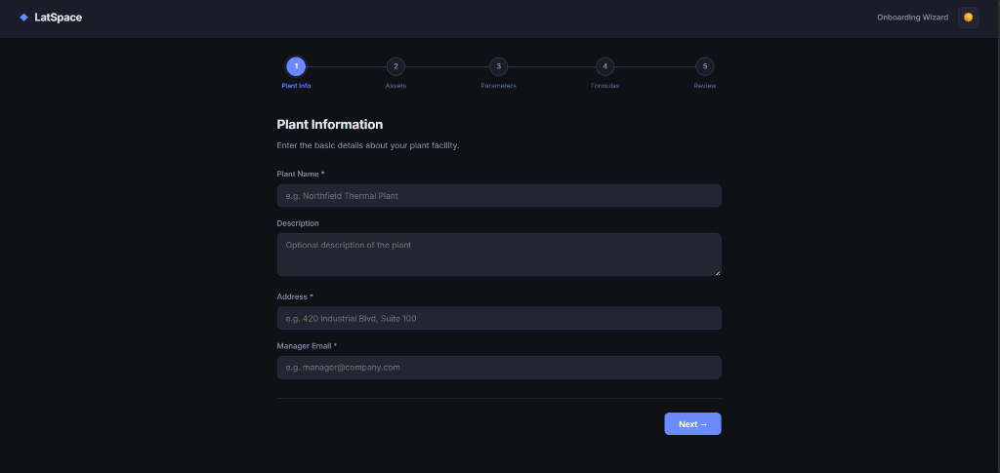
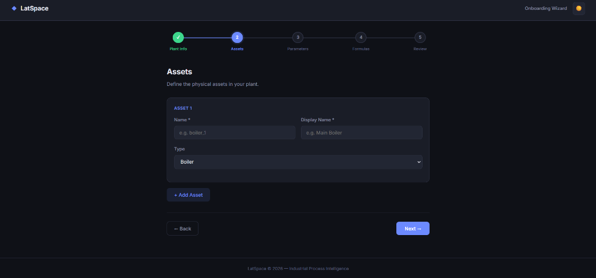
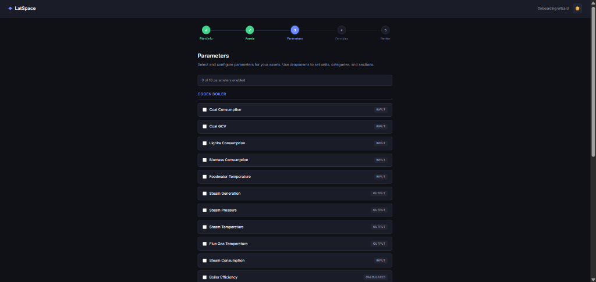
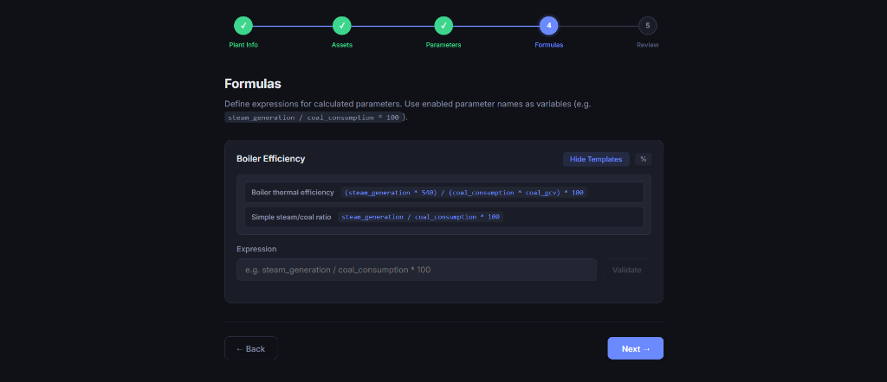
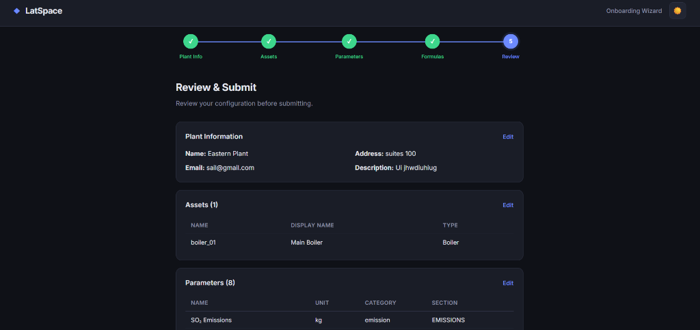
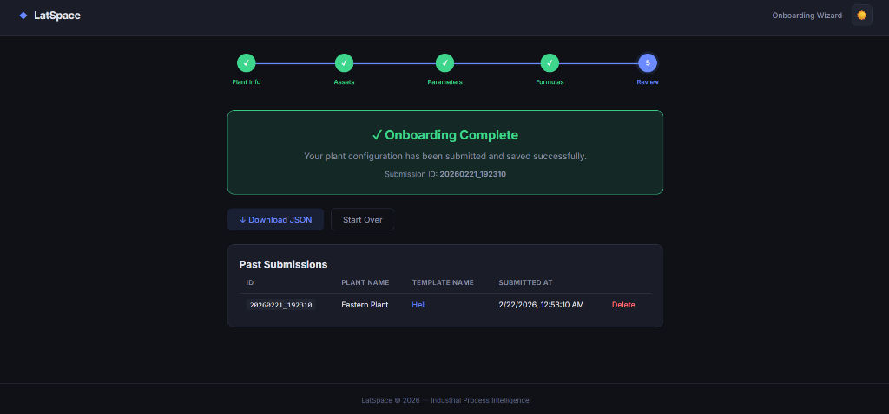
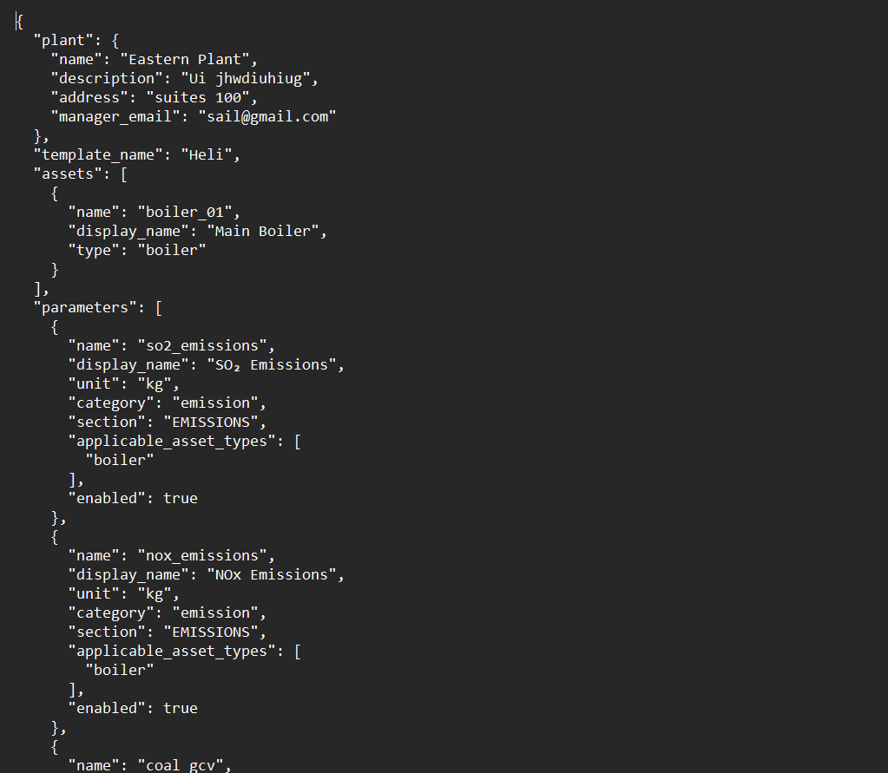

# Onboarding Wizard Screenshots

Here are the reference screenshots provided for the Onboarding Wizard interface:

## 1. Plant Information
The first step of the wizard where users provide basic details about their plant facility, such as the Plant Name, Description, Address, and Manager Email.

## 2. Assets
In this step, users define the physical assets present in their plant. They can add multiple assets by specifying a Name, Display Name, and selecting a Type (e.g., Boiler).

## 3. Parameters
Users configure parameters specific to the assets they defined. This involves selecting enabled parameters from a list and configuring attributes like unit, category, and section.

## 4. Formulas
This step allows users to define mathematical formulas for calculated parameters. They can use the names of previously enabled parameters as variables to build expressions (e.g., `steam_generation / coal_consumption * 100`) and test them using the Validate button.

## 5. Review & Submit
The final step provides a summary of all the configured information. Users can review their Plant Information, Assets, and Parameters, with options to navigate back and edit sections before final submission.

## 6. Submission Success & Past Submissions 
Displays a success message upon completion with a unique Submission ID. Below, it features a "Past Submissions" table listing previously submitted configurations along with options to download the JSON payload or delete the record.

## 7. Downloaded JSON View
A view of the raw JSON payload generated by the onboarding wizard, structuring the collected data including plant details, assets, and configured parameters for backend processing.

